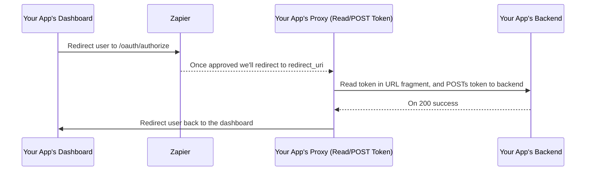

# Authentication

There are two ways to authenticate with the Partner API.

1. Your application's `client_id` which you will receive once you are approved for access to the API
2. A user's access token

Which authentication method you should use depends on which endpoint(s) you are using. Review each endpoint's documentation to understand which parameters are required.

> Note: while we do generate a `client_secret`, the type of grant we use (`implicit`) doesn't need it so it's not something we provide.

## Access Token

For resources that require a valid access token you can use the [OAuth2 protocol](https://www.digitalocean.com/community/tutorials/an-introduction-to-oauth-2). At the moment, we only permit the [`implicit`](https://tools.ietf.org/html/rfc6749#section-4.2) grant type. Should your use case require a different grant type [send us your request](mailto:partners@zapier.com). There's also a [suggested workaround on how to work with an implicit oauth flow below](#workaround-for-implicit-only).

### Procuring a Token

Construct the following URL, and redirect the user to authorize your application:

```
https://zapier.com/oauth/authorize?client_id={client_id}&redirect_uri={redirect_uri}&scope={scope}
```

|      Parameter      | Requirement | Explanation                                                                                                                                                                                                         |
| :-----------------: | :---------: | ------------------------------------------------------------------------------------------------------------------------------------------------------------------------------------------------------------------- |
|    **client_id**    |  Required   | Your application ID.                                                                                                                                                                                                |
|  **redirect_uri**   |  Required   | The URI you provided in the sign-up form. If you need to modify this, you'll need to [send us a request](mailto:partners@zapier.com).                                                                               |
|  **response_type**  |  Required   | Use `token`.                                                                                                                                                                                                        |
|      **scope**      |  Optional   | Space (`%20`) separated values. See each resource for their required scope, if any. This (and all other params) should be properly [url encoded](https://en.wikipedia.org/wiki/Percent-encoding).                   |
| **approval_prompt** |  Optional   | One of `auto` or `force`. Use `auto` if the second authorization (before expiration of previous token) should not prompt the user to re-authorize. Use `force` if the user should authorize your application again. |
|      **state**      |  Optional   | A unique string to help your application guard against XSRF.                                                                                                                                                        |

#### Example Prompt


### Receiving the Token, or Error

If the user cancels, or approves the authorization the user will be redirected to your `redirect_uri` with the following example urls:

**Approved**

```
http://your.redirect.url/#access_token=iuqhw8egojqenduvybtoken_type=Bearer&expires_in=36000&scope=zap
```

**Cancelled**

```
http://your.redirect.url/?error=access_denied
```

Your application should use JavaScript to parse the hash parameter and use the token as needed. The **access token will not expire**. If ever invalid, however, provide the user with the authorize flow once more. In the `implicit` grant type, there are no refresh tokens. You can use a hidden iframe with `approval_prompt=auto`, or ask the user to authorize once more, to receive new tokens.

### Using the token:

Preferred use of the tokens is via an HTTP Authorization Header.

```bash
curl -H "Authorization: Bearer {token}" "https://api.zapier.com/v1/zaps"
```

### Workaround for Implicit Only

While we consider and implement other OAuth flows, the following is a suggested workaround for working with the implicit OAuth flow. A sequence diagram is provided for the example:


<div style="display: none">

<!-- Recreate using https://mdp.tylingsoft.com/ and take a screenshot -->



</div>

The idea is to use an intermediate page that reads the access token from the URL fragment. An example like so: `https://your.app/your/redirect_uri#access_token=THE_USER_ACCESS_TOKEN`. Then the page would `POST` to your backend the access token. If you created a popup, you can also use a `postMessage` to pass the access token to the main page. Ultimately, you'll want to save the token to your backend for the signed in user. Once the backend returns a successful save, then redirect the user (or close the popup) back to the page you'd like the user to interact with your page and uses the access token.
