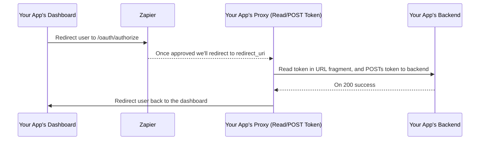

# Partner API

## Introduction
The Partner API is the best tool for complete style control over a user's Zapier experience within your app. Essentially, it lets you customize how you present Zapier within your product without sacrificing your app's look, feel, and flow.

Think of it as a native Zapier integration, helping you showcase your best Zapier-powered workflows where it's most helpful to your users (within the flow of your tool). You can customize styling, streamline Zap set-up for users, expose relevant Zap information, and more!


With the Partner API, you can:

- Get a list of all the apps available in Zapier’s app directory so you can power your app directory and show your users all the integration possibilities with your Zapier integration.
- Have complete style control over how you present Zap templates in your product. The Partner API gives you access to the raw Zap Template data so you can give your users access to your Zap template with your product’s style, look and feel.
- Get access to all your Zap templates and give your users the ability to search to quickly find the one they need.
- Streamline Zap setup by pre-filling fields on behalf of your users.
- Show users the Zaps they have set up from right within your product keeping them on your site longer and giving them complete confidence in their Zapier integration.
- [Embed our Zap Editor](./zap-editor/) to allow your users to create new Zaps and modify existing ones, without needing to leave your product.

Once your integration is public, the integration's client ID needed to call the Partner API will be revealed under the Embed > Settings or Embed > Partner API section of the [Developer Platform](https://developer.zapier.com/).

## Authentication

There are two ways to authenticate with the Partner API.

1. Your application's `client_id` which you will receive once you are approved for access to the API
2. A user's access token

Which authentication method you should use depends on which endpoint(s) you are using. Review each endpoint's documentation to understand which parameters are required.

> Note: while we do generate a `client_secret`, the type of grant we use (`implicit`) doesn't need it so it's not something we provide.

### Access Token

For resources that require a valid access token you can use the [OAuth2 protocol](https://www.digitalocean.com/community/tutorials/an-introduction-to-oauth-2). At the moment, we only permit the [`implicit`](https://tools.ietf.org/html/rfc6749#section-4.2) grant type. Should your use case require a different grant type [send us your request](mailto:partners@zapier.com). There's also a [suggested workaround on how to work with an implicit oauth flow below](#workaround-for-implicit-only).

#### Procuring a Token

Construct the following URL, and redirect the user to authorize your application:

```
https://zapier.com/oauth/authorize?client_id={client_id}&redirect_uri={redirect_uri}&scope={scope}
```

|      Parameter      | Requirement | Explanation                                                                                                                                                                                                         |
| :-----------------: | :---------: | ------------------------------------------------------------------------------------------------------------------------------------------------------------------------------------------------------------------- |
|    **client_id**    |  Required   | Your application ID.                                                                                                                                                                                                |
|  **redirect_uri**   |  Required   | The URI you provided in the sign-up form. If you need to modify this, you'll need to [send us a request](mailto:partners@zapier.com).                                                                               |
|  **response_type**  |  Required   | Use `token`.                                                                                                                                                                                                        |
|      **scope**      |  Optional   | Space (`%20`) separated values. See each resource for their required scope, if any. This (and all other params) should be properly [url encoded](https://en.wikipedia.org/wiki/Percent-encoding).                   |
| **approval_prompt** |  Optional   | One of `auto` or `force`. Use `auto` if the second authorization (before expiration of previous token) should not prompt the user to re-authorize. Use `force` if the user should authorize your application again. |
|      **state**      |  Optional   | A unique string to help your application guard against XSRF.                                                                                                                                                        |

**Example Prompt**


#### Receiving the Token, or Error

If the user cancels, or approves the authorization the user will be redirected to your `redirect_uri` with the following example urls:

**Approved**

```
http://your.redirect.url/#access_token=iuqhw8egojqenduvybtoken_type=Bearer&expires_in=36000&scope=zap
```

**Cancelled**

```
http://your.redirect.url/?error=access_denied
```

Your application should use JavaScript to parse the hash parameter and use the token as needed. The **access token will not expire**. If ever invalid, however, provide the user with the authorize flow once more. In the `implicit` grant type, there are no refresh tokens. You can use a hidden iframe with `approval_prompt=auto`, or ask the user to authorize once more, to receive new tokens.

#### Using the token:

Preferred use of the tokens is via an HTTP Authorization Header.

```bash
curl -H "Authorization: Bearer {token}" "https://api.zapier.com/v1/zaps"
```

#### Workaround for Implicit Only

While we consider and implement other OAuth flows, the following is a suggested workaround for working with the implicit OAuth flow. A sequence diagram is provided for the example:


<div style="display: none">

<!-- Recreate using https://mdp.tylingsoft.com/ and take a screenshot -->



</div>

The idea is to use an intermediate page that reads the access token from the URL fragment. An example like so: `https://your.app/your/redirect_uri#access_token=THE_USER_ACCESS_TOKEN`. Then the page would `POST` to your backend the access token. If you created a popup, you can also use a `postMessage` to pass the access token to the main page. Ultimately, you'll want to save the token to your backend for the signed in user. Once the backend returns a successful save, then redirect the user (or close the popup) back to the page you'd like the user to interact with your page and uses the access token.

## Endpoints

### GET /v1/apps

|            URL             | Protected By |
| :------------------------: | :----------: |
| **api.zapier.com/v1/apps** |  Client ID   |

> **Notes**
>
> - Your own app will not be returned.
> - Zapier built-in apps will not be returned.
> - Order of the result is by app popularity.

**Arguments**

Available parameters to the Apps resource:

| parameter                   | requirement | notes                                                                                         |
| --------------------------- | ----------- | --------------------------------------------------------------------------------------------- |
| **client_id**               | Required    | Your application client ID.                                                                   |
| **category**                | Optional    | Filter the results by app category.                                                           |
| **is_in_zap_template_with** | Optional    | Service slug that limits the results to apps that are included within the same Zap Templates. |
| **title_search**            | Optional    | Filter the results by matching title (case-insensitive).                                      |
| **title_starts_with**       | Optional    | Fetch apps with a title that starts with this value (case-insensitive).                       |
| **per_page**                | Optional    | (defaults to 100, max of 100) Limit the number of apps returned.                              |
| **page**                    | Optional    | (defaults to 1) The page number. Page number 1 refers to the first page in the result.        |

**Example Requests**

Get apps that can be integrated with my app.

```bash
curl -L "https://api.zapier.com/v1/apps?client_id=${client_id}"
```

Get a list of apps related to google

```bash
curl -L "https://api.zapier.com/v1/apps?client_id=${client_id}&category=google"
```

Get a list of apps that are included in the same Zap Template with my app

```bash
curl -L "https://api.zapier.com/v1/apps?client_id=${client_id}&is_in_zap_template_with"
```

Get the Google Calendar app

```bash
curl -L "https://api.zapier.com/v1/apps?client_id=${client_id}&title_search=google%calendar"
```

Get a list of apps where the title starts with google

```bash
curl -L "https://api.zapier.com/v1/apps?client_id=${client_id}&title_starts_with=google"
```

Get apps that can be integrated with my app, returning only 5 results per page

```bash
curl -L "https://api.zapier.com/v1/apps?client_id=${client_id}&per_page=5"
```

**Example Response**

> Refer to the [App object](#app) reference for all the available fields.

```json
{
  "total": 3649,
  "page": 2,
  "pages": 1825,
  "per_page": 2,
  "objects": [
    {
      "uuid": "ca83afc5-ee9a-470d-b577-e7f8fd555b67",
      "title": "Slack",
      "slug": "slack",
      "description": "Slack is a platform for team communication: everything in one place, instantly searchable, available wherever you go. Offering instant messaging, document sharing and knowledge search for modern teams.",
      "image": "https://zapier-images.imgix.net/storage/services/6cf3f5a461feadfba7abc93c4c395b33_2.png?auto=format%2Ccompress&ixlib=python-3.0.0&q=50",
      "url": "https://api.zapier.com/v1/embed/apps/google-ads/integrations/slack",
      "links": {
        "mutual:zap_templates": "https://api.zapier.com/v1/zap-templates?apps=slack"
      },
      "categories": [
        {
          "slug": "team-chat"
        }
      ],
      "images": {
        "url_16x16": "https://zapier-images.imgix.net/storage/services/6cf3f5a461feadfba7abc93c4c395b33_2.png?auto=format%2Ccompress&fit=crop&h=16&ixlib=python-3.0.0&q=50&w=16",
        "url_32x32": "https://zapier-images.imgix.net/storage/services/6cf3f5a461feadfba7abc93c4c395b33_2.png?auto=format%2Ccompress&fit=crop&h=32&ixlib=python-3.0.0&q=50&w=32",
        "url_64x64": "https://zapier-images.imgix.net/storage/services/6cf3f5a461feadfba7abc93c4c395b33_2.png?auto=format%2Ccompress&fit=crop&h=64&ixlib=python-3.0.0&q=50&w=64",
        "url_128x128": "https://zapier-images.imgix.net/storage/services/6cf3f5a461feadfba7abc93c4c395b33_2.png?auto=format%2Ccompress&fit=crop&h=128&ixlib=python-3.0.0&q=50&w=128"
      },
      "app_latest": "SlackAPI"
    },
    {
      "uuid": "d74234df-0045-436e-bd5b-ee577e74e6b8",
      "title": "Google Calendar",
      "slug": "google-calendar",
      "description": "Google Calendar lets you organize your schedule and share events with co-workers and friends. With Google's free online calendar, it's easy to keep track of your daily schedule.",
      "image": "https://zapier-images.imgix.net/storage/services/62c82a7958c6c29736f17d0495b6635c.png?auto=format%2Ccompress&ixlib=python-3.0.0&q=50",
      "url": "https://api.zapier.com/v1/embed/apps/google-ads/integrations/google-calendar",
      "links": {
        "mutual:zap_templates": "https://api.zapier.com/v1/zap-templates?apps=google-calendar"
      },
      "categories": [
        {
          "slug": "calendar"
        },
        {
          "slug": "google"
        }
      ],
      "images": {
        "url_16x16": "https://zapier-images.imgix.net/storage/services/62c82a7958c6c29736f17d0495b6635c.png?auto=format%2Ccompress&fit=crop&h=16&ixlib=python-3.0.0&q=50&w=16",
        "url_32x32": "https://zapier-images.imgix.net/storage/services/62c82a7958c6c29736f17d0495b6635c.png?auto=format%2Ccompress&fit=crop&h=32&ixlib=python-3.0.0&q=50&w=32",
        "url_64x64": "https://zapier-images.imgix.net/storage/services/62c82a7958c6c29736f17d0495b6635c.png?auto=format%2Ccompress&fit=crop&h=64&ixlib=python-3.0.0&q=50&w=64",
        "url_128x128": "https://zapier-images.imgix.net/storage/services/62c82a7958c6c29736f17d0495b6635c.png?auto=format%2Ccompress&fit=crop&h=128&ixlib=python-3.0.0&q=50&w=128"
      },
      "app_latest": "GoogleCalendarAPI"
    }
  ],
  "prev_url": "https://api.zapier.com/v1/apps?per_page=2&page=1",
  "next_url": "https://api.zapier.com/v1/apps?per_page=2&page=3"
}
```

### GET /v1/zap-templates

|                 URL                 | Protected By |
| :---------------------------------: | :----------: |
| **api.zapier.com/v1/zap-templates** |  Client ID   |

**Arguments**

Available parameters to the Zap templates resource:

| parameter     | requirement | notes                                                                                                                                                            |
| ------------- | ----------- | ---------------------------------------------------------------------------------------------------------------------------------------------------------------- |
| **client_id** | Required    | Your application client ID.                                                                                                                                      |
| **templates** | Optional    | A comma separated list of specific Zap templates.                                                                                                                |
| **apps**      | Optional    | A comma separated list of Zapier Apps to match Zap templates against. **Note: Your app will always be one of the apps.**                                         |
| **limit**     | Optional    | (defaults to 5, max of 100) Limit the number of Zap templates returned.                                                                                          |
| **offset**    | Optional    | (defaults to 0) The number of Zap templates to skip before beginning to return the Zap templates. The default value is 0, which is the offset of the first item. |

**Example Requests**

Get all Zap templates for my app.

```bash
curl -L "https://api.zapier.com/v1/zap-templates?client_id=${client_id}"
```

Get all Zap templates that include my app and another.

```bash
curl -L "https://api.zapier.com/v1/zap-templates?client_id=${client_id}&apps=mailchimp"
```

**Example Response**

> Refer to the [Zap template](#zap-template) reference for all the available fields.

```json
[
  {
    "id": 51652,
    "steps": [
      {
        "id": 1,
        "uuid": "b9df4eff-f311-44f9-ac54-2901f952c6ac",
        "title": "Google Ads",
        "slug": "google-ads",
        "description": "Google Ads (formerly Google AdWords) is an online advertising platform developed by Google, where advertisers pay to display brief advertisements, service offerings, product listings, video content, and generate mobile application installs within the Google ad network to web users.",
        "image": "https://zapier-images.imgix.net/storage/services/4058ec8b47ad751cbd39bd686cf4eab7.png?auto=format%2Ccompress&ixlib=python-3.0.0&q=50",
        "hex_color": "4285F4",
        "images": {
          "url_16x16": "https://zapier-images.imgix.net/storage/services/4058ec8b47ad751cbd39bd686cf4eab7.png?auto=format%2Ccompress&fit=crop&h=16&ixlib=python-3.0.0&q=50&w=16",
          "url_32x32": "https://zapier-images.imgix.net/storage/services/4058ec8b47ad751cbd39bd686cf4eab7.png?auto=format%2Ccompress&fit=crop&h=32&ixlib=python-3.0.0&q=50&w=32",
          "url_64x64": "https://zapier-images.imgix.net/storage/services/4058ec8b47ad751cbd39bd686cf4eab7.png?auto=format%2Ccompress&fit=crop&h=64&ixlib=python-3.0.0&q=50&w=64",
          "url_128x128": "https://zapier-images.imgix.net/storage/services/4058ec8b47ad751cbd39bd686cf4eab7.png?auto=format%2Ccompress&fit=crop&h=128&ixlib=python-3.0.0&q=50&w=128"
        },
        "api": "GoogleAdsCLIAPI@3.0.0",
        "url": "https://zapier.com/apps/google-ads/integrations?utm_medium=partner_api",
        "label": "New Campaign"
      },
      {
        "id": 2,
        "uuid": "ca83afc5-ee9a-470d-b577-e7f8fd555b67",
        "title": "Slack",
        "slug": "slack",
        "description": "Slack is a platform for team communication: everything in one place, instantly searchable, available wherever you go. Offering instant messaging, document sharing and knowledge search for modern teams.",
        "image": "https://zapier-images.imgix.net/storage/services/6cf3f5a461feadfba7abc93c4c395b33_2.png?auto=format%2Ccompress&ixlib=python-3.0.0&q=50",
        "hex_color": "510f4d",
        "images": {
          "url_16x16": "https://zapier-images.imgix.net/storage/services/6cf3f5a461feadfba7abc93c4c395b33_2.png?auto=format%2Ccompress&fit=crop&h=16&ixlib=python-3.0.0&q=50&w=16",
          "url_32x32": "https://zapier-images.imgix.net/storage/services/6cf3f5a461feadfba7abc93c4c395b33_2.png?auto=format%2Ccompress&fit=crop&h=32&ixlib=python-3.0.0&q=50&w=32",
          "url_64x64": "https://zapier-images.imgix.net/storage/services/6cf3f5a461feadfba7abc93c4c395b33_2.png?auto=format%2Ccompress&fit=crop&h=64&ixlib=python-3.0.0&q=50&w=64",
          "url_128x128": "https://zapier-images.imgix.net/storage/services/6cf3f5a461feadfba7abc93c4c395b33_2.png?auto=format%2Ccompress&fit=crop&h=128&ixlib=python-3.0.0&q=50&w=128"
        },
        "api": "SlackAPI",
        "url": "https://zapier.com/apps/slack/integrations?utm_medium=partner_api",
        "label": "Send Channel Message"
      }
    ],
    "title": "Send messages to Slack channels whenever new Google Ads campaigns launch",
    "slug": "send-messages-to-slack-channels-whenever-new-google-ads-campaigns-launch",
    "status": "published",
    "description_plain": "A new Google Ads campaign can mean the start of your next marketing push, but it can also mean the start of a ton of new sales and service workflows. Zapier gives you a head start on those projects by automatically posting a new message in Slack to a specific channel you choose. Give your teams the heads up they need before your new clients come rolling in!\n",
    "description_raw": "A new Google Ads campaign can mean the start of your next marketing push, but it can also mean the start of a ton of new sales and service workflows. Zapier gives you a head start on those projects by automatically posting a new message in Slack to a specific channel you choose. Give your teams the heads up they need before your new clients come rolling in!",
    "url": "https://zapier.com/apps/google-ads/integrations/slack/51652/send-messages-to-slack-channels-whenever-new-google-ads-campaigns-launch?utm_medium=partner_api",
    "description": "<p>A new Google Ads campaign can mean the start of your next marketing push, but it can also mean the start of a ton of new sales and service workflows. Zapier gives you a head start on those projects by automatically posting a new message in Slack to a specific channel you choose. Give your teams the heads up they need before your new clients come rolling in!</p>\n",
    "create_url": "https://api.zapier.com/v1/embed/google-ads/create/51652",
    "type": "guided_zap"
  }
]
```

**Paging through results using limit and offset**

By default, this API returns the first 5 Zap templates. To get a different set of items,
you can use the `offset` and `limit` parameters in the query string.

For example, to get 20 Zap templates, skipping the first 20 results:

```bash
curl -H "Authorization: Bearer {token}" \
  -L "https://api.zapier.com/v1/zap-templates?client_id=${client_id}&limit=20&offset=20"
```

### GET /v1/zaps

|            URL             | Protected By | Required Scopes |
| :------------------------: | :----------: | :-------------: |
| **api.zapier.com/v1/zaps** | Access Token |      `zap`      |

> **Note**
>
> 1. The zaps returned are narrowed/filtered by your Zapier app. For example, if you are Trello you'll only be returned a user's Zap that contain Trello in one of the steps of the Zap.
>
> 2. If your app is built with the [Zapier CLI](https://github.com/zapier/zapier-platform-cli) the Zaps returned are for **any** version of your app.

**Arguments**

Available parameters to the Zaps resource:

| parameter                   | requirement | notes                                                                                                                                      |
| --------------------------- | ----------- | ------------------------------------------------------------------------------------------------------------------------------------------ |
| **params\_\_{KEY}={VALUE}** | Optional    | Return Zaps that have a specific key/value set in the params (settings) of the Zap. |
| **get_params** | Optional    | Return Zaps along with their associated key/value param settings. |
| **limit** | Optional | (defaults to 5, max of 100) Limits the number of returned items |
| **offset** | Optional | (defaults to 0) the number of Zaps to skip before beginning to return the Zaps. The default value of 0, which is the offset of the first item. |

**Example Requests**

Get all Zaps in the user's account (note this will only include the OAuth app that is associated with the Zapier app).

```bash
curl -H "Authorization: Bearer {token}" -L "https://api.zapier.com/v1/zaps"
```

Get all Zaps in the user's account that have a particular Trello board (assuming the OAuth app is Trello).

```bash
curl -H "Authorization: Bearer {token}" -L "https://api.zapier.com/v1/zaps?&params__board=BOARD_ID"
```

Get all Zaps in the user's account and include their associated param key/value pairs (assuming the OAuth app is Trello).

```bash
curl -H "Authorization: Bearer {token}" -L "https://api.zapier.com/v1/zaps?&get_params"
```

**Example Response**

> Refer to the [Zap](#zap) reference for all the available fields.

```json
{
    "next": "https://api.zapier.com/v1/zaps?limit=2&offset=4",
    "previous": "https://api.zapier.com/v1/zaps?limit=2",
    "count": 20,
    "objects": [
        {
            "id": 159061877,
            "title": "",
            "state": "off",
            "steps": [
                {
                    "type_of": "read",
                    "app": {
                        "id": 730,
                        "uuid": "c91cc1ba-d8fb-4aaa-b71a-a325f7705f78",
                        "title": "Typeform",
                        "slug": "typeform",
                        "description": "Typeform helps you ask awesomely online! If you ever need to run a survey, questionnaire, form, contest etc. Typeform will help you achieve it beautifully across all devices, every time, using its next generation platform.",
                        "hex_color": "8bcbca",
                        "image": "https://zapier-images.imgix.net/storage/services/065860c1e1210fdf4040105024099b0a.png?auto=format%2Ccompress&ixlib=python-3.0.0&q=50",
                        "images": {
                            "url_16x16": "https://zapier-images.imgix.net/storage/services/065860c1e1210fdf4040105024099b0a.png?auto=format%2Ccompress&fit=crop&h=16&ixlib=python-3.0.0&q=50&w=16",
                            "url_32x32": "https://zapier-images.imgix.net/storage/services/065860c1e1210fdf4040105024099b0a.png?auto=format%2Ccompress&fit=crop&h=32&ixlib=python-3.0.0&q=50&w=32",
                            "url_64x64": "https://zapier-images.imgix.net/storage/services/065860c1e1210fdf4040105024099b0a.png?auto=format%2Ccompress&fit=crop&h=64&ixlib=python-3.0.0&q=50&w=64",
                            "url_128x128": "https://zapier-images.imgix.net/storage/services/065860c1e1210fdf4040105024099b0a.png?auto=format%2Ccompress&fit=crop&h=128&ixlib=python-3.0.0&q=50&w=128"
                        },
                        "api": "TypeformCLIAPI@1.0.25",
                        "url": "https://zapier.com/apps/typeform/integrations?utm_source=partner&utm_medium=embed&utm_campaign=partner_api&referer=None"
                    },
                    "params": null
                },
                {
                    "type_of": "write",
                    "app": {
                        "id": 60,
                        "uuid": "b9df4eff-f311-44f9-ac54-2901f952c6ac",
                        "title": "Trello",
                        "slug": "trello",
                        "description": "Trello is a team collaboration tool that lets you organize anything and everything to keep your projects on task.",
                        "hex_color": "0079bf",
                        "image": "https://zapier-images.imgix.net/storage/services/da3ff465abd3a3e1b687c52ff803af74.png?auto=format%2Ccompress&ixlib=python-3.0.0&q=50",
                        "images": {
                            "url_16x16": "https://zapier-images.imgix.net/storage/services/da3ff465abd3a3e1b687c52ff803af74.png?auto=format%2Ccompress&fit=crop&h=16&ixlib=python-3.0.0&q=50&w=16",
                            "url_32x32": "https://zapier-images.imgix.net/storage/services/da3ff465abd3a3e1b687c52ff803af74.png?auto=format%2Ccompress&fit=crop&h=32&ixlib=python-3.0.0&q=50&w=32",
                            "url_64x64": "https://zapier-images.imgix.net/storage/services/da3ff465abd3a3e1b687c52ff803af74.png?auto=format%2Ccompress&fit=crop&h=64&ixlib=python-3.0.0&q=50&w=64",
                            "url_128x128": "https://zapier-images.imgix.net/storage/services/da3ff465abd3a3e1b687c52ff803af74.png?auto=format%2Ccompress&fit=crop&h=128&ixlib=python-3.0.0&q=50&w=128"
                        },
                        "api": "TrelloAPI",
                        "url": "https://zapier.com/apps/trello/integrations?utm_source=partner&utm_medium=embed&utm_campaign=partner_api&referer=None"
                    },
                    "params": {
                        "checklist_name": "Checklist",
                        "card_pos": "bottom"
                    }
                }
            ],
            "url": "https://zapier.com/app/editor/159061877?utm_source=partner&utm_medium=embed&utm_campaign=partner_api&referer=None",
            "modified_at": "2022-08-22T15:17:30+00:00"
        },
        {
            "id": 159061916,
            "title": "",
            "state": "off",
            "steps": [
                {
                    "type_of": "read",
                    "app": {
                        "id": 730,
                        "uuid": "c91cc1ba-d8fb-4aaa-b71a-a325f7705f78",
                        "title": "Typeform",
                        "slug": "typeform",
                        "description": "Typeform helps you ask awesomely online! If you ever need to run a survey, questionnaire, form, contest etc. Typeform will help you achieve it beautifully across all devices, every time, using its next generation platform.",
                        "hex_color": "8bcbca",
                        "image": "https://zapier-images.imgix.net/storage/services/065860c1e1210fdf4040105024099b0a.png?auto=format%2Ccompress&ixlib=python-3.0.0&q=50",
                        "images": {
                            "url_16x16": "https://zapier-images.imgix.net/storage/services/065860c1e1210fdf4040105024099b0a.png?auto=format%2Ccompress&fit=crop&h=16&ixlib=python-3.0.0&q=50&w=16",
                            "url_32x32": "https://zapier-images.imgix.net/storage/services/065860c1e1210fdf4040105024099b0a.png?auto=format%2Ccompress&fit=crop&h=32&ixlib=python-3.0.0&q=50&w=32",
                            "url_64x64": "https://zapier-images.imgix.net/storage/services/065860c1e1210fdf4040105024099b0a.png?auto=format%2Ccompress&fit=crop&h=64&ixlib=python-3.0.0&q=50&w=64",
                            "url_128x128": "https://zapier-images.imgix.net/storage/services/065860c1e1210fdf4040105024099b0a.png?auto=format%2Ccompress&fit=crop&h=128&ixlib=python-3.0.0&q=50&w=128"
                        },
                        "api": "TypeformCLIAPI@1.0.25",
                        "url": "https://zapier.com/apps/typeform/integrations?utm_source=partner&utm_medium=embed&utm_campaign=partner_api&referer=None"
                    },
                    "params": null
                },
                {
                    "type_of": "write",
                    "app": {
                        "id": 60,
                        "uuid": "b9df4eff-f311-44f9-ac54-2901f952c6ac",
                        "title": "Trello",
                        "slug": "trello",
                        "description": "Trello is a team collaboration tool that lets you organize anything and everything to keep your projects on task.",
                        "hex_color": "0079bf",
                        "image": "https://zapier-images.imgix.net/storage/services/da3ff465abd3a3e1b687c52ff803af74.png?auto=format%2Ccompress&ixlib=python-3.0.0&q=50",
                        "images": {
                            "url_16x16": "https://zapier-images.imgix.net/storage/services/da3ff465abd3a3e1b687c52ff803af74.png?auto=format%2Ccompress&fit=crop&h=16&ixlib=python-3.0.0&q=50&w=16",
                            "url_32x32": "https://zapier-images.imgix.net/storage/services/da3ff465abd3a3e1b687c52ff803af74.png?auto=format%2Ccompress&fit=crop&h=32&ixlib=python-3.0.0&q=50&w=32",
                            "url_64x64": "https://zapier-images.imgix.net/storage/services/da3ff465abd3a3e1b687c52ff803af74.png?auto=format%2Ccompress&fit=crop&h=64&ixlib=python-3.0.0&q=50&w=64",
                            "url_128x128": "https://zapier-images.imgix.net/storage/services/da3ff465abd3a3e1b687c52ff803af74.png?auto=format%2Ccompress&fit=crop&h=128&ixlib=python-3.0.0&q=50&w=128"
                        },
                        "api": "TrelloAPI",
                        "url": "https://zapier.com/apps/trello/integrations?utm_source=partner&utm_medium=embed&utm_campaign=partner_api&referer=None"
                    },
                    "params": {
                        "checklist_name": "Checklist",
                        "card_pos": "bottom"
                    }
                }
            ],
            "url": "https://zapier.com/app/editor/159061916?utm_source=partner&utm_medium=embed&utm_campaign=partner_api&referer=None",
            "modified_at": "2022-08-22T15:17:30+00:00"
        }
    ]
}
```

### GET /v1/profiles/me

|            URL                    | Protected By | Required Scopes     |
| :-------------------------------: | :----------: | :-----------------: |
| **api.zapier.com/v1/profiles/me** | Access Token |      `profile`      |

**Example Requests**

Get user information related to the given `access_token`

```bash
curl -H "Authorization: Bearer {token}" -L "https://api.zapier.com/v1/profiles/me"
```

**Example Response**

> Refer to the [Profile](#profile) reference for all the available fields.

```json
{
    "id": 88998899,
    "first_name": "Jacob",
    "last_name": "Corwin",
    "email": "jacob.corwin@gmail.com",
    "email_confirmed": true,
    "timezone": null,
    "full_name": "Jacob Corwin"
}
```

### GET /v1/categories

|               URL                | Protected By |
| :------------------------------: | :----------: |
| **api.zapier.com/v1/categories** |     None     |

**Arguments**

Available parameters to the categories resource:

| parameter  | requirement | notes                                                                                                                                                  |
| ---------- | ----------- | ------------------------------------------------------------------------------------------------------------------------------------------------------ |
| **limit**  | Optional    | (defaults to 10, max of 100) Limit the number of Zap templates returned.                                                                               |
| **offset** | Optional    | (defaults to 0) The number of categories items to skip before returning new categories. The default value is 0, which is the offset of the first item. |

**Example Requests**

Get a list of Zap categories

```bash
curl -L "https://api.zapier.com/v1/categories"
```

**Example Response**

> Refer to the [AppCategory](#appcategory) reference for all the available fields.

```json
{
    "next": "https://api.zapier-staging.com/v1/categories?limit=10&offset=10",
    "previous": null,
    "count": 90,
    "objects": [
        {
            "id": 7,
            "title": "Accounting",
            "slug": "accounting",
            "description": "Tools for accounting and finance.",
            "url": "https://zapier-staging.com/api/v4/app-directory/categories/accounting/",
            "type_of": "curated",
            "featured_entry_slug": "favorite-zaps-accounting",
            "role": "child"
        },
        {
            "id": 77,
            "title": "Ads & Conversion",
            "slug": "ads-conversion",
            "description": "Tools to track and reach an audience online.",
            "url": "https://zapier-staging.com/api/v4/app-directory/categories/ads-conversion/",
            "type_of": "curated",
            "featured_entry_slug": "boost-google-ads-ROI-with-zapier",
            "role": "child"
        },
        {
            "id": 104,
            "title": "AI Tools",
            "slug": "ai-tools",
            "description": "Unlock the potential of artificial intelligence in your workflow with these AI integrations. These apps use AI to tackle everything from natural language processing to image classification, providing you with unparalleled automation power.",
            "url": "https://zapier-staging.com/api/v4/app-directory/categories/ai-tools/",
            "type_of": "curated",
            "featured_entry_slug": null,
            "role": "parent"
        },
        {
            "id": 87,
            "title": "All",
            "slug": "all",
            "description": "Contains all the services.",
            "url": "https://zapier-staging.com/api/v4/app-directory/categories/all/",
            "type_of": "auto",
            "featured_entry_slug": null,
            "role": "parent"
        },
        {
            "id": 57,
            "title": "Amazon",
            "slug": "aws",
            "description": "Tools from Amazon to host and manage sites and applications on the Amazon cloud.",
            "url": "https://zapier-staging.com/api/v4/app-directory/categories/aws/",
            "type_of": "curated",
            "featured_entry_slug": "what-you-should-automate",
            "role": "child"
        },
        {
            "id": 24,
            "title": "Analytics",
            "slug": "analytics",
            "description": "Tools to measure and report on success",
            "url": "https://zapier-staging.com/api/v4/app-directory/categories/analytics/",
            "type_of": "curated",
            "featured_entry_slug": "automate-analytics-tools",
            "role": "child"
        },
        {
            "id": 31,
            "title": "App Builder",
            "slug": "app-builder",
            "description": "Tools to build a custom app with forms and databases.",
            "url": "https://zapier-staging.com/api/v4/app-directory/categories/app-builder/",
            "type_of": "curated",
            "featured_entry_slug": null,
            "role": "child"
        },
        {
            "id": 95,
            "title": "App Families",
            "slug": "app-families",
            "description": "",
            "url": "https://zapier-staging.com/api/v4/app-directory/categories/app-families/",
            "type_of": "curated",
            "featured_entry_slug": null,
            "role": "parent"
        },
        {
            "id": 105,
            "title": "Artificial Intelligence",
            "slug": "artificial-intelligence",
            "description": "Unlock the potential of artificial intelligence in your workflow with these AI integrations. These apps use AI to tackle everything from natural language processing to image classification, providing you with unparalleled automation power.",
            "url": "https://zapier-staging.com/api/v4/app-directory/categories/artificial-intelligence/",
            "type_of": "curated",
            "featured_entry_slug": null,
            "role": "parent"
        },
        {
            "id": 86,
            "title": "Beta",
            "slug": "beta",
            "description": "Beta services.",
            "url": "https://zapier-staging.com/api/v4/app-directory/categories/beta/",
            "type_of": "auto",
            "featured_entry_slug": null,
            "role": "child"
        }
    ]
}
```

### Data Objects

#### App

| attribute       | type   | notes                                                                                                                                                 |
| --------------- | ------ | ----------------------------------------------------------------------------------------------------------------------------------------------------- |
| **uuid**        | String | The unique canonical identifier to the app.                                                                                                           |
| **description** | String | Plain text description of the app.                                                                                                                    |
| **links**       | Object | Link to get mutual Zap templates from Zapier's Partner API.                                                                                           |
| **title**       | String | The name of the app.                                                                                                                                  |
| **url**         | String | An absolute url to the Zapbook Apps page.                                                                                                             |
| **image**       | String | The app's logo in large format.                                                                                                                       |
| **images**      | Object | Thumbnails for the app image. <br><small>Available sizes (and respective keys):<br> `url_128x128`, `url_64x64`, `url_32x32`, and `url_16x16`.</small> |
| **slug**        | String | A URL/SEO friendly ID for the app.                                                                                                                    |
| **categories**  | Object | A list of categories this app belongs to.                                                                                                             |
| **app_latest**  | String | An identifier for the app's production version.                                                                                                       |

```json
{
  "uuid": "ca83afc5-ee9a-470d-b577-e7f8fd555b67",
  "description": "Slack is a platform for team communication: everything in one place, instantly searchable, available wherever you go. Offering instant messaging, document sharing and knowledge search for modern teams.",
  "links": {
    "mutual:zap_templates": "https://api.zapier.com/v1/zap-templates?apps=slack"
  },
  "title": "Slack",
  "url": "https://zapier.com/partner/embed/apps/trello/integrations/slack",
  "image": "https://cdn.zapier.com/storage/developer/57b336375384ab62cc06e7e83d5c3622_2.png",
  "images": {
    "url_16x16": "https://cdn.zapier.com/storage/developer/57b336375384ab62cc06e7e83d5c3622_2.16x16.png",
    "url_32x32": "https://cdn.zapier.com/storage/developer/57b336375384ab62cc06e7e83d5c3622_2.32x32.png",
    "url_128x128": "https://cdn.zapier.com/storage/developer/57b336375384ab62cc06e7e83d5c3622_2.128x128.png",
    "url_64x64": "https://cdn.zapier.com/storage/developer/57b336375384ab62cc06e7e83d5c3622_2.64x64.png"
  },
  "slug": "slack",
  "categories": [
    {
      "slug": "team-chat"
    },
    {
      "slug": "top-100"
    }
  ]
}
```

#### AppCategory

| attribute               | type                                      | notes                                                                                                                                                                                                                                                            |
| ----------------------- | ----------------------------------------- | ---------------------------------------------------------------------------------------------------------------------------------------------------------------------------------------------------------------------------------------------------------------- |
| **id**                  | String                                    | Unique identifier for the category.                                                                                                                                                                                                                              |
| **title**               | String                                    | Plain text description of the category.                                                                                                                                                                                                                          |
| **slug**                | String                                    | URL/SEO friendly ID for the Zap template.  API.                                                                                                                                                                                                                  |
| **description**         | String |  Detailed explanation of the app category.
| **url**                 | String                                    | An absolute url to the Zapbook Apps page.                                                                                                                                                                                                                        |
| **type_of**             | String                                    | Category type. 'Curated' categories are maintained by Zapier staff, 'Automatically Generated' categories are maintained by automation and populated with the 'rebuild_special_categories' command, 'Other' categories are manually created for various purposes. |
| **featured_entry_slug** | String                                    | Alternative slug for the category.                                                                                                                                                                                                                               |
| **role**                | String                                    | Indicates if the category is a 'parent' or a 'child'.                                                                                                                                                                                                            |

```json
{
    "id": 104,
    "title": "AI Tools",
    "slug": "ai-tools",
    "description": "Unlock the potential of artificial intelligence in your workflow with these AI integrations. These apps use AI to tackle everything from natural language processing to image classification, providing you with unparalleled automation power.",
    "url": "https://zapier.com/api/v4/app-directory/categories/ai-tools/",
    "type_of": "curated",
    "featured_entry_slug": null,
    "role": "parent"
}
```

#### Profile

| attribute           | type            | notes                                                 |
| ------------------- | --------------- | ----------------------------------------------------- |
| **id**              | Number          | The ID of the User.                                   |
| **first_name**      | String          | User's first name.                                    |
| **last_name**       | String          | User's last name.                                     |
| **email**           | String          | User's email.                                         |
| **email_confirmed** | Boolean         | Says if the user confirmed the email to Zapier.       |
| **timezone**        | String          | User's timezone.                                      |
| **full_name**       | String          | User's full name                                      |

```json
{
    "id": 88998899,
    "first_name": "Jacob",
    "last_name": "Corwin",
    "email": "jacob.corwin@gmail.com",
    "email_confirmed": true,
    "timezone": null,
    "full_name": "Jacob Corwin"
}
```

#### Zap

| attribute       | type            | notes                                                 |
| --------------- | --------------- | ----------------------------------------------------- |
| **id**          | Number          | The ID of the Zap.                                    |
| **modified_at** | Date            | The last modified date time.                          |
| **state**       | String          | One of `'on'`, `'off'`, or `'draft'`                  |
| **steps**       | Array<Zap Step> | An array steps in the Zap. See [Zap Step](#zap-step). |
| **title**       | String          | The name of the Zap, if any, otherwise `null`.        |
| **url**         | String          | An absolute url to the Zap (to edit).                 |

```json
{
  "id": 125,
  "modified_at": "2017-03-22T09:38:11-05:00",
  "state": "on",
  "steps": [{ "See Step object definition ..." }],
  "title": "Create Trello cards from new Typeform entries",
  "url": "https://zapier.com/app/editor/125"
}

```

#### Zap Step

| attribute   | type   | notes                                                                      |
| ----------- | ------ | -------------------------------------------------------------------------- |
| **type_of** | String | One of `'read'`, `'write'`, `'filter'`, `'search'`, or `'search_or_write'` |
| **app**     | App    | The app for the step. See [App object](#app).                              |

```json
{
  "app": {
    /* See the App object definition ... */
  },
  "type_of": "read"
}
```

#### Zap Template

| attribute             | type       | notes                                                                                                                         |
| --------------------- | ---------- | ----------------------------------------------------------------------------------------------------------------------------- |
| **id**                | Number     | The ID of the Zap Template                                                                                                    |
| **create_url**        | String     | An absolute URL used to create the Zap.                                                                                       |
| **description**       | String     | The HTML-rendered description provided when the Zap template was created.                                                     |
| **description_plain** | String     | Plain text (HTML tags stripped) description. **Note: `\r` and `\n` replaced with space character. Artifacts may be present.** |
| **description_raw**   | String     | The [Markdown][markdown] description provided when the Zap template was created.                                              |
| **slug**              | String     | A URL/SEO friendly ID for the Zap template.                                                                                   |
| **steps**             | Array<App> | An array of two or more steps in the Zap template. See [App object](#app).                                                    |
| **title**             | String     | The name of the Zap template.                                                                                                 |
| **status**            | String     | The status of the Zap template (choices: `draft`, `published`).                                                               |
| **url**               | String     | An absolute url to the Zapbook Zap template Page.                                                                             |

```json
{
  "create_url": "https://zapier.com/webintent/create-zap?template=10127&utm_campaign=Zap%20Templates%20Partners%20API&embedded=true&referrer=FacebookLeadsAPI&utm_source=partners&utm_medium=api&selected_apis=FacebookLeadsAPI,MailchimpCLIAPI@1.0.10",
  "description": "<p>Facebook Lead Ads are an...",
  "description_plain": "Facebook Lead Ads ... ",
  "description_raw": "**Facebook Lead Ads** are an ...",
  "slug": "subscribe-new-facebook-lead-ads-mailchimp-list",
  "status": "published",
  "steps": [
    {
      /* ... see App object definition ... */
    }
  ],
  "title": "Subscribe new Facebook Lead Ad leads to a MailChimp list",
  "url": "https://zapier.com/apps/inside-sales-box/integrations/zoho-crm/12084/add-new-leads-created-in-inside-sales-box-to-zoho-crm"
}
```

## Errors
Zapier uses HTTP response codes to indicate the success or failure of an API request.

| Code    | Status            | Explanation                                                                |
| ------- | ----------------- | -------------------------------------------------------------------------- |
| **200** | OK                | Successful request.                                                        |
| **400** | Bad Request       | Invalid request, or invalid parameters .                                   |
| **403** | Authentication    | Not authorized.                                                            |
| **404** | Not Found         | The resource requested was not found.                                      |
| **429** | Too Many Requests | Too many requests were performed within a window of time. Try again later. |
| **5xx** | Server Error      | A fatal error occurred while processing the request. Try again.            |

All errors will be JSON object with a String array of errors:

```json
{
  "errors": ["Malformed request"]
}
```

## Changelog
- 2023-05-25

  - Added query parameters to `v1/apps`

    - The endpoint `/v1/apps` supports query parameters `title_search`, `title_starts_with`, `category`, and `is_in_zap_template_with` for more refined app search results.

  - Added query parameter to `v1/zaps`

    - The endpoint `/v1/zaps` supports the query parameters `get_params`.

  - Added endpoint `/v1/categories`

    - The new endpoint `/v1/categories` returns a list of supported zap categories.

- 2023-03-30

  - Added attribute to `v1/apps`

    - The endpoint `/v1/apps` exposes the `app_latest` string attribute representing the SelectedAPI and production version for each app.

- 2022-08-29

  - Removed restriction to `v1/zaps`

    - The endpoint `/v1/zaps` now performs param filtering on both triggers and actions.

- 2022-05-23
  
  - Added attribute to `v1/zaps`
  
    - The endpoint `/v1/zaps` exposes the `uuid` attribute to each step app. This attribute is a UUID v4 string.

- 2021-08-03
  
  - Added attribute to `v1/zap-templates`
  
    - The endpoint `/v1/zap-templates` exposes the `uuid` attribute to each step. This attribute is a UUID v4 string.

- 2021-07-29
  
  - Added `v1/profiles/me`
  
    - The endpoint return information about the user whose `access_token` is authorized.
  
    - Check the endpoint [documentation](https://platform.zapier.com/partner_api/endpoints#get-v1profilesme) for the payload structure.

  - Added pagination to `v1/zaps`
  
    - The endpoint `/v1/zaps` supports `limit`/`offset` query parameters to paginate the results.
  
    - `count`/`next`/`previous` have been added to the response payload.

- 2021-06-01
  
  - [DEPRECATION] After July 5, 2021, the endpoint `v1/zap-template/me` will no longer exist.

- 2021-05-13

  - Added attributes to existing endpoint payloads

    - The endpoint `/v1/apps` exposes the `uuid` attribute for each app that is returned. This attribute is a UUID v4 string.

    - The endpoint `/v1/zap-templates` exposes the `label` attribute to each step. A `null` placeholder value is used if the label is unable to be resolved.

  - Updated example endpoint payloads

    - The example payloads for endpoints `/v1/apps` and `/v1/zap-templates` have been updated to reflect these new attributes.

- 2021-01-14

  - Introducing rate limiting

    - The endpoints are now rate limit protected. The limit is set to 9,000 requests per hour for an individual endpoint.

- 2018-05-31

  - New `/apps` endpoint

    - This is a new endpoint that returns a list of apps in Zapier's App Directory.

- 2018-03-19

  - Updated `/zap-templates` and `/zap-templates/me`

    - These endpoints now accept an `offset` parameter to support pagination through results.

- 2018-02-12

  - Faster `/zap-templates` lookup.

    - Sub-second responses to the `/v1/zap-templates` even when requesting up to 100 Zap templates.

- 2017-11-01

  - Access tokens never expire.

    - After security review, the access tokens granted **will no longer expire**. This may change in the future, however, based on endpoints provided by the API. In that event, we expect API consumers to provide the user with the authorize endpoint to get a fresh access token.

- 2017-10-16

  - `/zaps`

    - The endpoint will now return **all** Zaps regardless of the [Zapier CLI App's version](https://github.com/zapier/zapier-platform-cli) that was used when creating the Zap.
